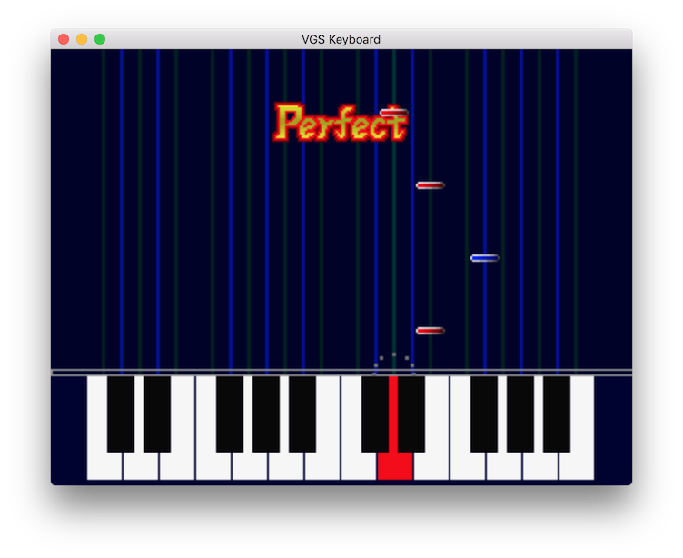

# [WIP] VGS Keyboard

## これは何
- VGSの技術 + MIDIキーボードを使った音ゲーを作ろうとしているものです
- まだ作りかけです _(ある程度遊べるようになったらWIPを外します)_



> _楽曲データの販売でマネタイズすれば良いんじゃないかと思っている（ついでに、それなら同人ショップでデータを売れるから東方二次創作でもイケる）ので, ゲーム本体はオープンソース＆完全無料というスタイルで開発しています_

## TODO
現時点での進捗を書いておきます（この通りに作るとは限りませんが）
- [x] MIDIキーボードからの入力に反応する鍵盤を作る
- [x] MIDIキーボードからの入力に反応するサウンドモジュールを作る
- [x] 単発ノーツ
- [ ] ロング・ノーツ
- [ ] コンボ
- [x] 判定演出
- [ ] VGS musicとノーツの連携
- [ ] 東方VGSの[赤より紅い夢](https://github.com/suzukiplan/Touhou-VGS-MML-data/blob/master/data/BSLOT000.mml)で遊べる状態にする

## License
[GPLv3](COPYING)

## Requirements 
完成した段階で Windows にも移植するつもりですが, 開発段階では Mac限定 で公開する方針です。（私のメイン環境が Mac なので）
- Mac OSX / mac OS
- XCode
- Git
- CocoaPods
- VGS mk-II CLIs
- MIDI keyboard (24 keys)

> - MIDI keyboardは24鍵以上のものであれば何でも問題ありませんが, 推奨機種は Korg の [nanoKEY2](http://www.korg.com/jp/products/computergear/nanokey2/) です
> - Core MIDI を使って実装しているので, 将来的には iPad にも対応するかもしれません（その前提でキーボードではなく, タッチインタフェースを意識したUI設計にするかもしれません）

## How to build 
```
git clone https://github.com/suzukiplan/vgs-keyboard.git
cd vgs-keyboard
make init
```
あとは、XCodeでビルドすれば起動できます。

> - `make rom` は最新状態への更新（`git pull`）をした時に `romdata` ディレクトリ下が更新される時に再実行する必要があります
> - `make init` に失敗する場合 [Requirements](#Requirements) の環境が整っていないものと考えられます

